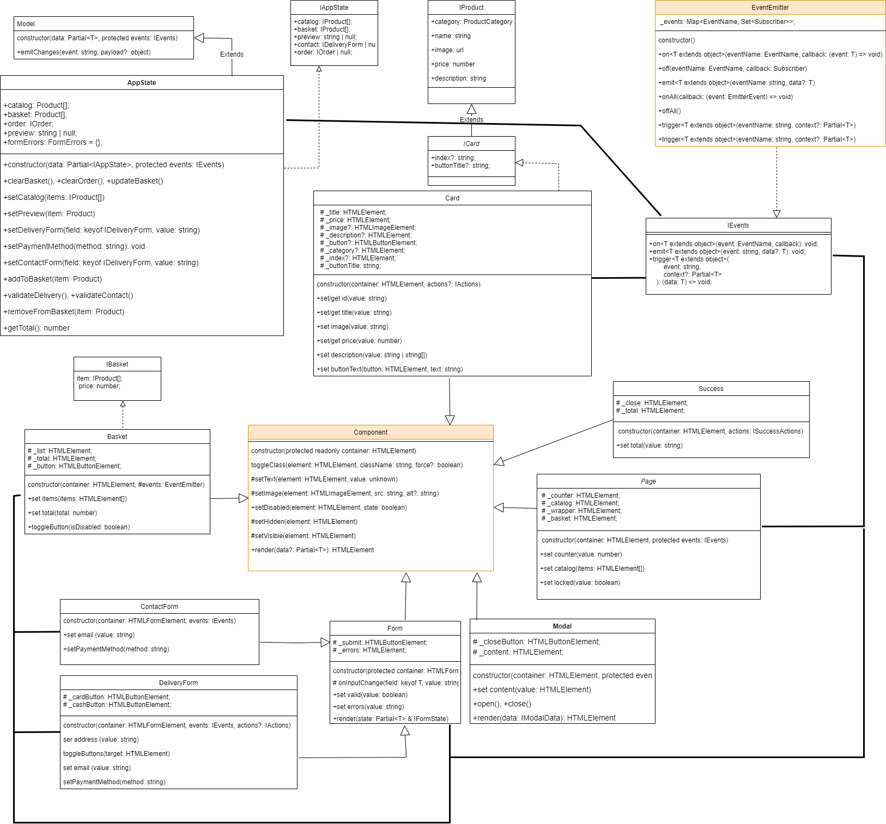

# Проектная работа "Веб-ларек"

Стек: HTML, SCSS, TS, Webpack

Структура проекта:
- src/ — исходные файлы проекта
- src/components/ — папка с JS компонентами
- src/components/base/ — папка с базовым кодом

Важные файлы:
- src/pages/index.html — HTML-файл главной страницы
- src/types/index.ts — файл с типами
- src/index.ts — точка входа приложения
- src/styles/styles.scss — корневой файл стилей
- src/utils/constants.ts — файл с константами
- src/utils/utils.ts — файл с утилитами

## Установка и запуск
Для установки и запуска проекта необходимо выполнить команды

```
npm install
npm run start
```

или

```
yarn
yarn start
```
## Сборка

```
npm run build
```

или

```
yarn build
```
## Базовый код
### Класс Model
Абстрактный класс. Используется для создания модельных данных. Содержит конструктор и метод, сообщающий, что модель изменилась.

### Класс Component
Абстрактный класс. Используется для создания компонентов пользовательского интерфейса.
Содержит конструктор и ряд методов для универсальной работы с DOM -компонентами: 
- toggleClass - переключается класс;
- setText (защищенный) - устанавливает текстовое содержимое;
- setImage (защищенный) - устанавливает изображения и альтернативный текст;
- setDisabled - изменяет статус блокировки;
- setHidden, setVisible - скрывает/отображает элемент;
- render - возвращает корневой DOM-элемент.

### Класс Api
Класс отвечает за работу API. Имеет конструктор, методы get и post, обработчик ответа от сервера (защищенный).

### EventEmitter
Этот класс - брокер событий (Observer). Содержит конструктор, а также:
- устанавливает и снимает обработчик событий;
- инициирует событие с данными;
- слушает все события;
- сбрасывает все обработчики;
- триггер, генерирующий событие при вызове.

## Компоненты модели данных
### Класс AppState
Этот класс отвечает за работу приложения в целом. Содержит конструктор и методы:
- clearBasket, addToBasket, removeFromBasket, updateBasket - очищает корзину, добавляет и удаляет из нее товары, обновляет ее;
- clearOrder - очищает информацию о заказе;
- setCatalog - меняет список покупок;
- setPreview - предпросмотр товара;
- getTotal - считает сумму заказа;
- setPaymentMethod - изменяет метод оплаты;
- setDeliveryForm, setContactForm - проверяет заполненность форм заказа;
- validateDelivery, validateContact - проверяет валидацию форм заказа;
Наследуется от Model<IAppState>. Может использоваться для отображения.

### Класс Form
Класс для работы с формами в целом. Наследуется от Component<IFormState>
Содержит конструктор и методы, отвечающие за работу с валидностью и ошибками при заполнении форм.

### Классы DeliveryForm и ContactForm
Эти классы отвечают за работу c данными о заказчике. Содержат конструкторы и методы, 
отвечающие за добавление/изменение информации о пользователе
Наследуется от Form<IDeliveryForm>. Может использоваться для отображения.

## Компоненты представления

### Класс Page
Класс для отображения основных элементов страницы: каталог продуктов, счетчик товаров. Наследуется от Component<IPage>
Содержит конструктор и методы:
- set counter - устанавливает значение счетчика;
- set catalog - заменяет содержимое каталога;
- set locked - переключает блокировку интерфейса;

### Класс Card
Класс для отображения и работы пользователя с карточкой товара. Наследуется от Component<ICard>
Содержит конструктор и методы:
- set/get id - управляет индификатором карточки.
- set/get title - управляет названием товара.
- set/get category - управляет категорией и ее цветом.
- set/get price - управляет ценой товара.
- set image - устанавливает изображение товара.
- set description - устанавливает описание товара.
- set buttonTitle - устанавливает textContent кнопки.

### Modal
Класс для создания и управления модальными окнами. Позволяет открывать и закрывать модальное окно, а так же управлять его содержимым. Наследуется от Component<IModal>.
Содержит конструктор и методы:
- content - собирает содержимое модального окна;
- open - открывает модальное окно;
- close - закрывает модальное окно;
- render - генерирует модальное окно с собраным содержимым и открывает его.


### Класс Basket
Класс для отображения и работы корзины. Отвечает за отображение товаров, управление их выбором и стоимостью. Наследуется от Component<IBasket>.
Содержит конструктор и методы:
- toggleButton - переключает доступность кнопки.
- set items - устанавливает товары в корзине.
- set total - устанавливает общую стоимость товаров.

### Класс Success 
Класс для отображения финального окна.
Содержит конструктор и метод, показывающий итоговый счет. Наследуется от Component<ISuccess>


## Ключевые типы данных
```
Типы данных для базовых классов:

export type ProductCategory =
	| 'софт-скил'
	| 'другое'
	| 'дополнительное'
	| 'кнопка'
	| 'хард-скил'
	| string;
export type PaymentMethod = 'онлайн' | 'при получении' | string;

//интерфейс для товаров
export interface IProduct {
	id: string;
	category: ProductCategory;
	title: string;
	price: number;
	description: string;
	image: string;
}

export interface IBasket {
	item: IProduct[];
	price: number;
}
//данные о пользователе
export interface IDeliveryForm {
	payment?: PaymentMethod;
	address?: string;
	email?: string;
	phone?: string;
}

// итоговые данные корзины
export interface IOrder extends IDeliveryForm {
	total: number;
	items: string[];
}

// итоговый счет
export interface IOrderTotal {
	id: string;
	total: number;
}

// Отображение карточки
export interface ICard extends IProduct {
	index?: string;
	buttonTitle?: string;
}

// Отображение корзины
export interface IBasket {
	items: HTMLElement[];
	total: number;
}

// Состояние приложения
export interface IAppState {
	catalog: IProduct[];
	basket: IProduct[];
	preview: string | null;
	contact: IDeliveryForm | null;
	order: IOrder | null;
}

// Ошибки в формах
export type FormErrors = Partial<Record<keyof IOrder, string>>;

// Действия передаваемые в конструктор
export interface IActions {
	onClick: (event: MouseEvent) => void;
}


## Архитектура


